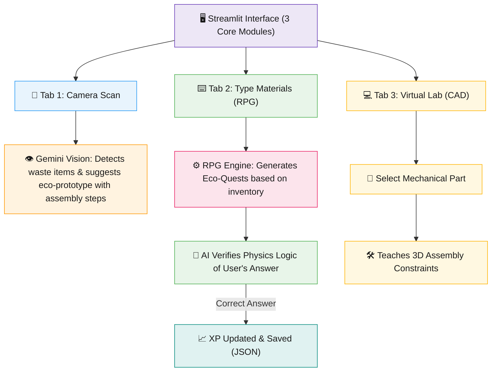

# 🌿 Omni-STEM: Eco-Build Lab
**Turning everyday household waste into engineering marvels — a 2.1 Billion Ton Free Laboratory.**

Millions of students globally lack access to expensive STEM kits, while the world generates billions of tons of plastic and cardboard waste. **Omni-STEM** bridges this gap. It is an AI-powered, gamified EdTech platform that scans your household scrap ("Kachra") and transforms it into interactive mechanical and electrical engineering blueprints. 

Built for **SH Hacks V1** (Theme: AI x STEM Education).

🔗 **Live Demo:** [Add your Streamlit link here once deployed]
🎥 **Video Pitch:** [Add your YouTube link here]

---

## ✨ Key Features

* **📸 AI Vision Engine:** Don't have a robotics kit? No problem. Upload a photo of plastic bottles, DC motors, or cardboard. The AI extracts the materials and suggests a scientifically viable engineering prototype (e.g., River Surface Water Cleaner).
* **🎮 "Jugaad Master" RPG Loop:** Learning is gamified. The engine acts as a Dungeon Master, giving you building quests. You earn XP by correctly answering real-world physical logic (like Center of Gravity or Torque).
* **🛠️ Virtual CAD Lab Concepts:** Teaches industrial-level design logic (Assembly constraints like Mate and Flush) for students who want to transition from physical cardboard to 3D software.
* **💾 Persistent Game State:** Uses a lightweight local JSON database to save student progression, inventory, and XP across sessions.

---

## 🏗️ Architecture



**How a query flows based on your module:**
1. **Camera Scan:** You upload a photo. The AI detects useful household scrap and provides a step-by-step blueprint to build a prototype, explained in your preferred language (e.g., Hinglish).
2. **RPG Mode:** You manually enter your materials. The AI acts as a Game Master, gives you a quest, and verifies your mechanical logic. Correct answers grant XP.
3. **Virtual Lab:** You select a virtual part and learn 3D CAD constraints (like Mate/Flush) without needing physical materials.

---

## 🛠️ Tech Stack

Built with a monolithic architecture for rapid prototyping and seamless full-stack deployment.

| Layer | Technology |
|---|---|
| 🖥️ Framework | Streamlit (Python Full-Stack UI) |
| 🧠 Core Intelligence | Google Gemini 1.5 Flash API (Multimodal: Text & Vision) |
| 🗄️ Database | Local JSON File System (State Management) |
| ☁️ Deployment | Streamlit Community Cloud |

---

## 📂 Project Structure

```text
├── app.py                  # Main application file (UI, API calls, Game Logic)
├── requirements.txt        # Python dependencies
├── save_game.json          # Persistent lightweight database for XP and User State
├── .gitignore              # Secures API keys and virtual environments
└── .streamlit/             # Hidden folder (contains secrets.toml for Gemini API Key)
```

---

## ⚙️ Setup & Run Locally (For Judges/Developers)

### Prerequisites
* Python 3.10+
* A [Gemini API key](https://aistudio.google.com/)

### 1. Clone & Install
```bash
git clone [https://github.com/disha516/OMNI-STEM.git](https://github.com/disha516/OMNI-STEM.git)
cd OMNI-STEM
pip install -r requirements.txt
```

### 2. Configure Environment
Create a `.streamlit` folder and add a `secrets.toml` file inside it:
```toml
GEMINI_API_KEY = "your_actual_api_key_here"
```

### 3. Run the App
```bash
streamlit run app.py
```

---

## 🚧 Challenges Solved

* **State Management in Streamlit:** Streamlit naturally reruns the script on every interaction. Implemented a robust `st.session_state` combined with a persistent JSON file to ensure the RPG game loop and XP don't reset unexpectedly.
* **Multimodal AI Prompting:** Tuning the Gemini 1.5 prompt to act strictly as a "Game Master" rather than a generic chatbot, forcing it to test the user's mechanical logic instead of just giving away the answers.

---

## 🔮 What's Next?
* 📱 Porting the core logic to a React Native mobile app for better camera access.
* 🤝 Multiplayer classrooms where students can combine their digital scrap to build larger virtual machines.
* 🏫 Partnering with local NGOs to distribute the platform in rural areas where hardware kits are completely unavailable.

---

## 👩‍💻 Built By
**Disha**
*Solo Developer | First-Year Electrical Engineering Student, IIT Delhi* ⚡

Driven by the belief that quality engineering education should cost $0.

---

## 📜 License
This project is open-source and available under the **MIT License**.
